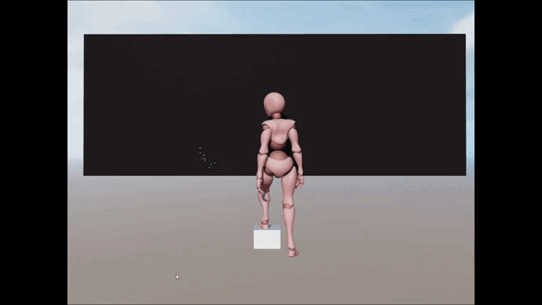

# DEMO 项目：阿摩依小姐（Ms.Amoy）

本项目是为了演示 Cocos Creator Marionette 动画系统的使用。

本项目包括以下场景：

- [Ms.Amoy](./docs/MsAmoy/README.zh-Hans-CN.md)，一个第三人称场景，演示了 Marionette 的基本用法。

- [Catch Me!](./assets/Demos/CatchMe/CatchMe.scene)，该场景演示了 Cocos Creator 3.8.0 引入的程序式动画的用法。

  

